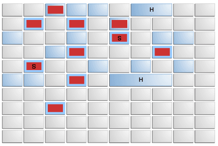

# 堆布局



***<u>The young generation</u>*** contains ***<u>eden regions (red)</u>*** and **<u>*survivor regions (red with "S")*</u>**. 

***<u>Old regions (light blue)</u>*** make up the old generation. Old generation regions may be **humongous (light blue with "H")** for objects that span multiple regions.（浅蓝色）构成了老年代。对于跨越多个区域的对象，老年代区域可能非常庞大，称之为H区（浅蓝色并标有“H”）。

# 对象在堆中的位置变化

## 初始分配内存时

应用程序始终会将对象分配到年轻代，即 Eden 区，但超大对象除外，这些对象会直接分配到老年代。

大对象被分配到连续regions 的老年代, 占用的内存从第一个region 的开始位置，到最后一个region的结束位置。即使真实的占用没有占满最后一个region。【内存碎片】

## GC 活动周期


*<u>**Normal young collections**</u>* 

通过复制算法，整理移动到 S区 或者  提升新生代对象到老年代。

###  Concurrent Start young collection 

标记确定老年代区域中的存活对象，通过mixed-gc 的方式 ，JVM进行正常的 *<u>**Normal young collections**</u>*  和 部分老年代的收集【老年代区域中的对象被复制到其他老年代区域】。

对于存活的H区对象，仅判断是否存活，存活时不会移动位置。不存活时，收集这个区域。

通常，只有在标记阶段结束后的清理暂停期间，或者在对象变得不可达时进行完整垃圾回收（Full GC）期间，才能回收大型对象。

但是，对于基本类型数组（例如布尔型、各种整数类型和浮点数值）等大型对象，G1垃圾收集器提供了一种特殊机制。如果大型对象在任何垃圾回收暂停期间没有被许多对象引用，G1 会尝试在此时回收它们。

只有在第一次完整垃圾回收（Full GC）未能释放足够的连续内存用于分配庞大对象，并且在同一暂停期间的第二次完整垃圾回收也失败后，庞大对象才会在最后的回收尝试中移动。这个过程非常缓慢。由于包含庞大对象末尾的堆区域中存在不可用的空间，G1 仍然可能因内存不足而退出虚拟机。

# GC 触发时机

## *<u>**Normal young collections**</u>* 

1. eden 区内存不足以分配
2. 庞大对象的分配可能会导致垃圾回收暂停提前发生。G1 会在每次分配庞大对象时检查初始堆占用阈值，如果当前占用率超过该阈值，则可能会立即强制执行初始标记年轻代回收。

## MIXED-***<u>GC</u>***

1. 在老年代分配失败

## ***<u>FULL</u>***-GC

1. 当G1垃圾收集器判断继续回收老年代区域无法获得足够多的可用空间，空间回收阶段【space reclamation】就结束了。 此时若内存空间不足时，触发Full-GC
2. 手动调用 System.gc()

# 参数

```sh
# 堆区域的大小。默认值基于最大堆大小，计算结果大约为渲染 2048 个区域，最大符合人体工程学的值为 32 MB。用户指定的大小必须是 2 的幂，有效值范围为 1 到 512 MB。
-XX:G1HeapRegionSize=<ergo> 
# 最大暂停时间间隔的目标值。默认情况下，G1 不设置任何目标值，这允许 G1 在极端情况下连续执行垃圾回收。
-XX:GCPauseTimeInterval = <ergo>
# 在最初几个回收周期中，G1 将使用老年代 45% 的占用率作为标记开始阈值
-XX:+G1UseAdaptiveIHOP -XX:InitiatingHeapOccupancyPercent=45
# 来禁用显式垃圾回收,该标志会使虚拟机忽略对 System.gc() 的调用
-XX:+DisableExplicitGC 

```


