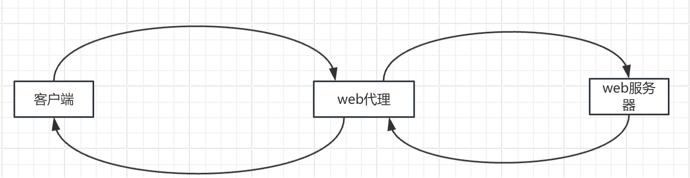

[toc]

# URL

用户在为获取资源，需要了解和执行的动作太多。不同的资源，执行的动作也不同。
URL 统一了用户访问获取资源的方式。

URL 常用格式如下

```html
<scheme>://<host>:<port>/<path>;<param>?<query>
<scheme>://<user>:<password>@<host>:<port>/<path>;<param>?<query>

<path> 路径段可以有多个，每个<path> 都可以有自己的<param>
<param> 的格式：key=value, 存在多个时用 ； 分割
<query> 的格式：key=value，存在多个时 用 & 分割
```

## URL的 可移植性 和完整性

URL 需要在各种 因特网协议 中 安全的，完整的传输，同时保证人类可读，不能有不可见字符。
### 字符集
ASCII的可见非受限字符 + 不安全的字符转义机制。
转义表示法：% 后面跟着两个ASCII码的16进制数。

发送URL前，对不安全的字符进行编码，在应用程序解释URL前，要对URL进行解码。

# HTTP 报文结构
请求报文结构
```html
<method> <request-url> <version>
<headers>

<entity-body>

header 可以有 0个 或者多个。

每行一个，单行格式 key : value。 

首部以空行结束。

HTTP规范定义了几种首部字段，应用程序可以随意发明自己的首部字段。

```

响应报文结构
```html
<version> <status> <reason-phrase>
<headers>

<entity-body>
```


首部和方法配合工作，共同决定了客户端和服务器能够做什么事情。


# HTTP结构

## 代理

严格意义上，代理连接两个或者多个使用相同协议的程序。

代理服务器可以看到并且触摸所有流过的HTTP流量。代理可以监视流量并对它进行修改。

 

### 代理是如何获取流量的

1. 通过修改客户端
2. 通过修改网络，在客户端不知情的情况下，拦截网络流量并导入代理。这种拦截都依赖于监视HTTP流量的交换设备或者路由设备。
3. 修改DNS的命名空间，替代物。
4. 修改web服务器配置，向客户端发送重定向的命令。

### 首部Via

Via 首部 会记录报文途径的每个中间节点（代理或者网关）有关的信息。报文每经过一个节点，必须将这个中间节点添加到Via列表的末尾。

Server首部用于记录原始服务器的。

对于需要隐藏内部网络设计或者拓扑结构的组织，代理应该将一个有序Via路标序列条目合并成一个联合条目。

### Trace 方法

可以用Trace 方法 观察在通过HTTP代理网络逐条转发报文的过程中，报文是怎么变化的。当整条请求报文到达目的服务器时，整条请求报文会封装在一条HTTP响应的主体中回送给发送端，


## 网关

多数网关扮演协议转换的角色。

应用程序服务器，会将目标服务器与网关结合在一起实现，应用程序服务器是服务器端网关，与客户端通过HTTP通信，并与服务器端的应用程序相连。

## 缓存

Web缓存是可以自动保存常见文档副本的HTTP设备。

### 首部

```html
文档过期
Cache-Control 首部  Cache-Control：max-age 以秒为单位
Expires 首部     Expires:指定一个绝对日期


服务器再验证
If-Modified-Since : <date> 从指定日期之后文档被修改过，就执行请求方法
If-None-Match: <tags>  版本标识符不配备，就执行请求方法


```


## 隧道，中继


# Web 服务器如何处理 HTTP事务

## 建立连接

客户端请求建立到服务器的TCP连接时，web服务器可以接受 或者拒绝 建立连接。

当服务器接受建立新连接时，会将新连接添加到其现存的web服务器连接列表中，做好监视连接上数据传输的准备。

## 接受请求报文

连接上有数据到达时，web服务器会从连接中读取数据，并解析出请求报文中的内容。

解析请求报文时，web服务器会不定期地从网络上接受输入数据，并将部分报文数据临时存储到缓冲区中，直到收到足以进行解析的数据并理解其意义为止。

解析过程如下

1. 解析请求行。查找请求方法，指定的资源标识符，以及版本号。各项之间通过空格分割，并以回车换行序列作为行的结束。
2. 读取以CRLF结尾的报文首部
3. 监测到以CRLF结尾的，标识首部结束的空行。（如果有的话）
4. 如果有的话（长度有Content-length 首部指定），读取请求主体。

## 处理请求报文

处理请求方法，请求报文的首部。


## 对资源的映射 以及 访问

### 用请求URI 作为名字来访问web服务器文件系统中的文件

Web 站点 的文档根目录 ：docroot。

虚拟托管的web服务器，可以在一个web服务器提供多个web站点。每个web站点有自己的根目录。通过在请求首部或者URI中的IP地址使用正确的文档根目录。

### 用请求URI 作为名字来访问web服务器文件系统中的目录

返回目录下的索引文件（index.html）的内容。

### 将URI映射 到 按需动态生成内容的程序中去

web服务器能够分辨出资源什么时候是动态的，动态内容生成程序位于何处，以及如何运行那个程序。

### 服务器端包含项（SSI）

如果某个资源被标识为存在服务器端包含项，服务器就会在将其发送给客户端之前，对资源内容进行处理。这是动态生成内容的便捷方式之一。过程如下

1. 扫描资源内容，以查找特定的模版，这些模版可以是变量名，嵌入式脚本。
2. 可以用变量的值或者可执行脚本的输出 来取代特定的模版。

## 构建响应报文

## 发送响应

## 记录HTTP事务日志


# 
