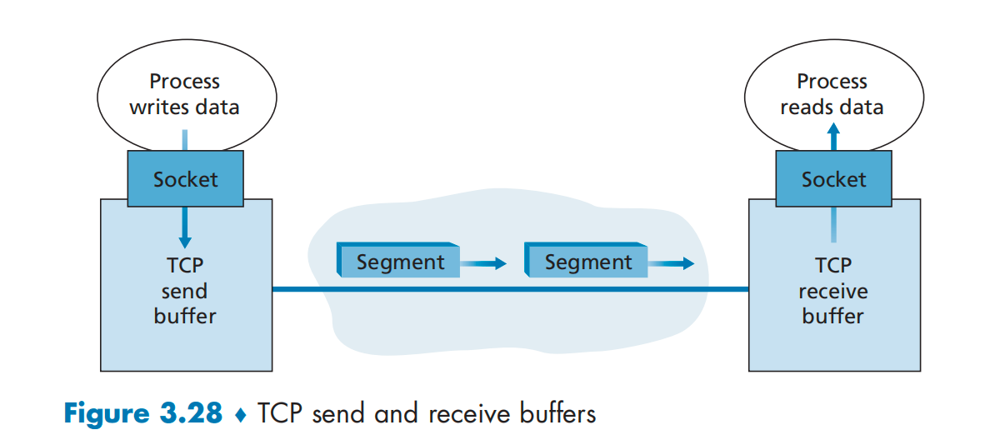
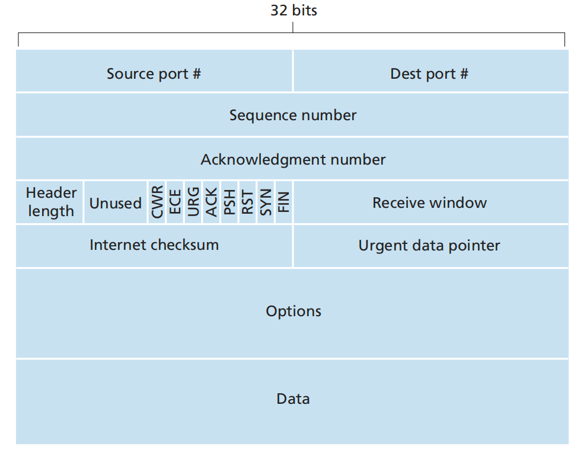
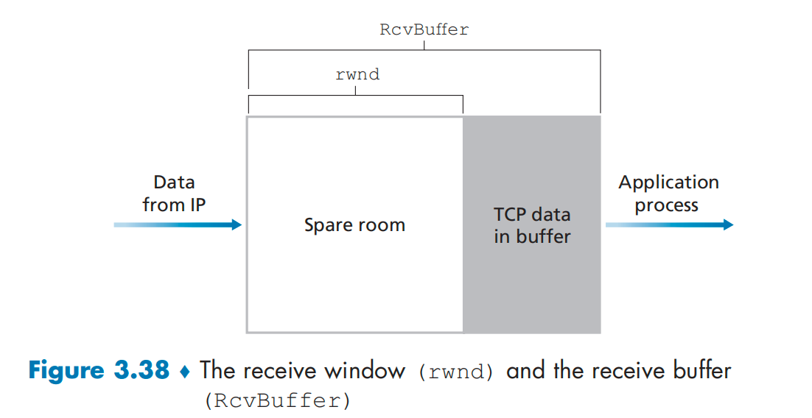
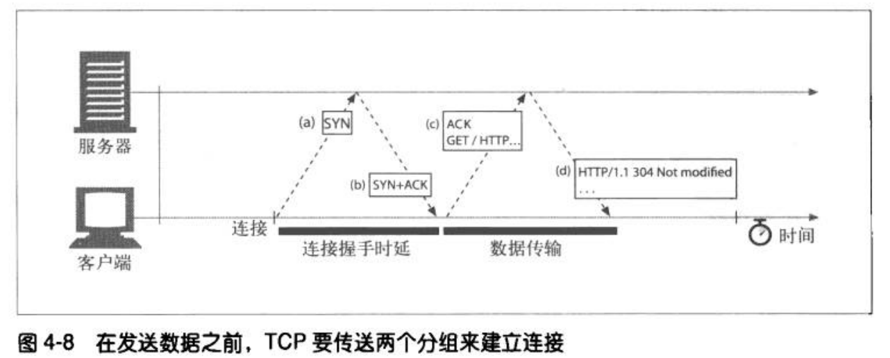

# TCP 连接

TCP ： Transmission Control Protocol 传输层控制协议。

Connect-oriented ,面向连接

## TCP 连接组成



## TCP 报文段格式



## TCP 流量控制

MSS : TCP 报文段中数据的最大长度。受限于链路层的最大传输单元 MTU。需要满足 MSS + TCP/IP 首部字段 将 适合链路层帧。

TCP为它的应用程序提供了流量控制服务，以消除 发送方 使 接收方 接收缓存溢出的可能。

TCP 通过让发送方维护一个接收窗口的变量，来提供流量控制。接收窗口的变量取值来源于对端的报文中的接收窗口字段。接受端计算原理如下

rwnd = RcvBuffer – [LastByteRcvd – LastByteRead] ，效果如下图。



发送端 满足如下条件

未确认的数据量 = LastByteSent – LastByteAcked <= rwnd 

当rwnd字段为0时，发送端会发送一个只有一个字节数据的报文段。这个报文段会被接受端确认，最终接受端缓存会清空，并且确认报文里会包含一个非0的rwnd。

## TCP拥塞控制

分组重传是网络拥塞的先兆。

网络层没有为传输层提供拥塞控制的显示支持。传输层必须通过观察网络行为来推断。

### 网络拥塞的代价

1. 路由器的排队时延
2. 发送方由于路由器的丢包而必须执行重传该报文
3. 发送方超时重传 已经发送但实际在网络中尚未丢失的分组，冗余包。
4. 多台路由器，多条路径下，下一个路由器丢失上一个路由器转发的分组，浪费了发送端到上一个路由器使用的链路容量。

### 拥塞控制机制

rwnd：接收窗口,cwnd ：拥塞窗口

在一个发送发中未确认的字节量不会超过cwnd,rwnd 中的最小值。

#### 慢启动

发送速率最大为 cwnd /RTT , 单位是 字节/秒。通过调整cwnd,可以调整连接发送报文的速率【rwnd无限的情况】

上一次阻塞时的 一半cwnd 称之为 ssthresh

cwnd初始设置为一个MSS 。当发送方收到ack时，cwnd = cwnd * cwnd; 直到cwnd 超过 ssthresh。

#### 拥塞避免

cwnd = cwnd + 1 ，直到网络拥塞。

#### 快速恢复

拥塞避免阶段发生网络拥塞时，cwnd = cwnd / 2。然后执行拥塞避免阶段。 


# HTTP 连接

当接收端【对端】关闭接受信道后，发送端向对端发送报文，对端操作系统会向发送端回送一条TCP连接被对端重置的报文。此时发送端操作系统会当作严重的错误来处理，删除还未读取的所有缓存数据。当发送端 应用程序 去读数据的时候，会收到一个连接被对端重置的错误，已缓存的响应数据就都丢失了。

## TCP连接编程 常见 套接字接口函数

```shell
s = socket(<params>) # 创建一个新的，未命名的，未关联的套接字

bind(s,<local Ip:port>) # 向套接字赋一个本地端口号 和 接口

connect(s, <remote Ip:port>) # 创建一条连接， 连接 本地套接字 与 远程主机和端口

listen(s,...) # 标识一个套接字，使其可以合法接收连接

s2 = accept(s) # 等待某人建立一条到本地端口的连接

n = read(s,buffer,n) # 尝试从套接字向缓冲区读取n个字节

n = write(s,buffer,n) # 尝试从缓冲区向套接字写入n个字节

close(s) # 完全关闭 tcp 连接

shutdown(s,<side>) # 只关闭tcp 连接的输入或输出端

getsocket(s,...) # 读取某个内部套接字的配置

setsocket(s,...) # 修改某个内部套接字的配置
```

## HTTP - TCP 时延

HTTP over TCP over IP

HTTP over SSL/TSL over TCP over IP

### TCP连接 握手时延 

当要建立一条新的TCP连接时，TCP要先传送两个TCP分组来建立连接。【发送端的 SYN ，以及 接受端的 SYN+ACK 】



小的HTTP事务，可能在TCP连接建立上花费的时间比例可能会很高（50%或以上）。

### 延迟确认

背景： IP 层 没有实现可靠的分组传输，当路由器超过负荷时，可以随意丢弃分组。

TCP通过实现自己的确认机制来确保数据的成功传输。每个TCP报文段都有一个序列号和完整性校验和。每个TCP报文段的接受者收到完整无损的报文时，都会向发送者回送小的确认分组。如果发送者在指定时间内没收到确认信息，就认为发送的报文已经破环或者损毁，会进行该TCP报文段的重新发送。

由于确认报文很小，所以TCP允许在发往相同方向的输出数据分组对其进行“捎带”，以便有效的利用网络。

很多TCP栈都实现了一种“延迟确认” 算法。 延迟确认算法：在一个特定的时间窗口内（100-200ms），将输出的确认分组放在输出缓冲区中，以寻找能够捎带它的输出数据分组。如果在这个时间段内没有输出数据分组，就将确认信息放在单独的TCP分组中传送。

####  对HTTP 的影响

HTTP具有双峰特征的 请求-应答 行为 降低了捎带信息的可能。当希望有相同方向的回传数据分组时，偏偏没有这么多。通常延迟确认算法会引起相当大的时延。可以调整或者禁止延迟确认算法。但对配置修改前要确认，应用程序不会引发这些算法想要避免的问题。

### TCP 慢启动

慢启动限制了TCP端点在任意时刻传输的分组数。当HTTP事务有大数据量要发送时，就不能一次将所有分组都发送出去，受限于拥塞窗口的大小。会造成新连接的传输速度比已经交换过一些数据的连接速度慢一些。

需要通过重用已有的TCP连接来避免。HTTP的持久连接。

### Nagle 算法

为个避免一个TCP报文只携带很少的数据。发送端会在试图发送一个分组前，将大量的TCP数据绑定到一起，以提高网络效率。非全尺寸的数据会挂机在缓冲区，并在以下情况发送（可能有遗漏）

1. 全尺寸的其他组发送完成
2. 非全尺寸的组被确认
3. 缓存中累积了足够一个全尺寸的非全尺寸组

HTTP通过设置参数TCP_NODELAY来禁用Nagle算法。

### TIME_WAIT 累积 与 端口耗尽

性能基准测试的场景下，通常只有一台或者几台机器用来产生流量。

```html
TCP 套接字的4个值 , 只有 source-port 可变。
<source-ip> <source-port> <destination-ip> <destination-port>

但是源端口的数量比如有60000个，并且在 2MSL 秒内连接是无法重用的。  （2MSL 比如 120秒）
连接速率 = 60000 / 120 = 500 次/秒   
```

大量处于打开状态或者等待状态的连接，分配了大量的控制块 会严重影响操作系统的速度。

## 如何正确关闭连接

应用程序可以关闭TCP输入和输出信道中的任意一个，也可以同时关闭。

套接字调用close() 会将 TCP 连接的 输入和输出信道 都关闭，此时称作完全关闭。

套接字调用shutdown() 会单独的关闭 TCP 连接的 输入和输出信道，此时称为半关闭。

想要正常关闭连接的应用程序应该先半关闭其输出信道，然后周期性地检查其输入信道的状态（ 查找 数据 或者流 的末尾）。如果在一定的时间区间内对端没有关闭输入信道，应用程序可以强制关闭连接，以节省资源。
