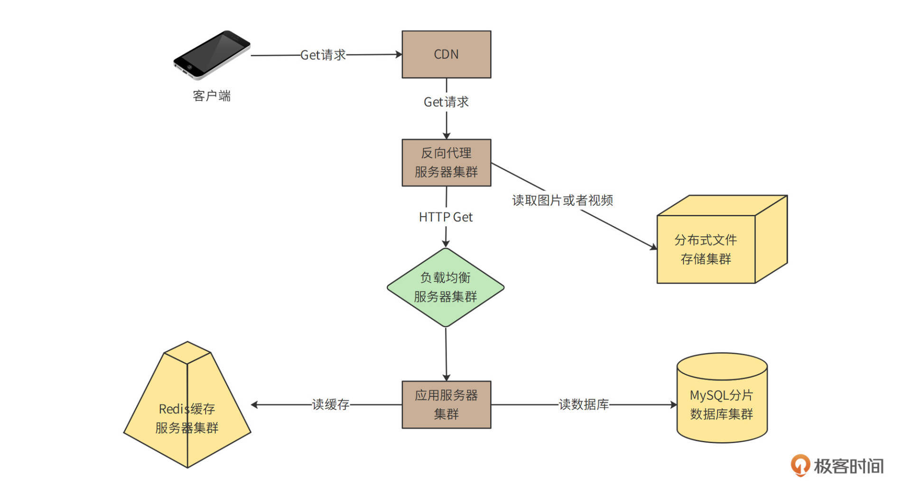
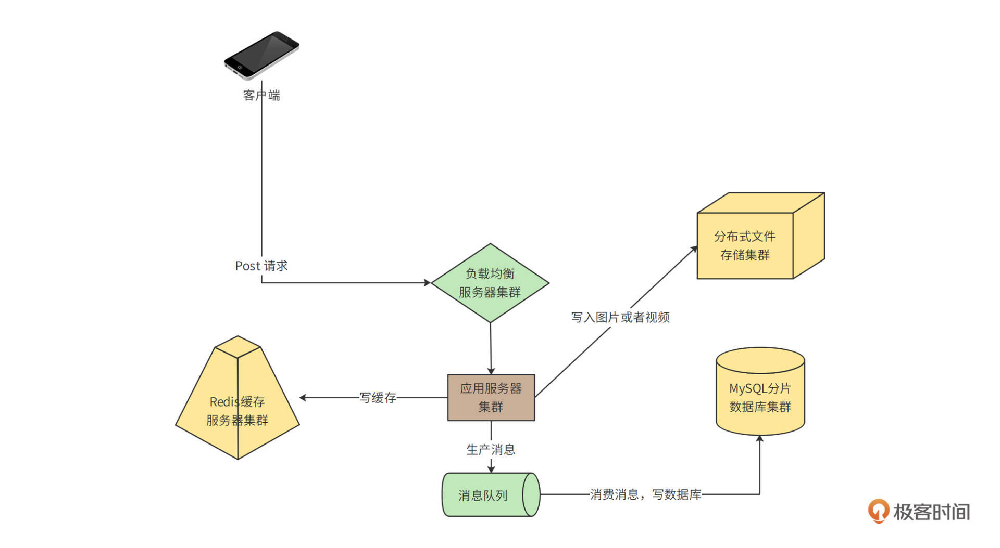
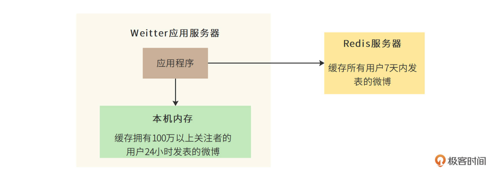

[toc]

# 需求分析

## 业务功能分析

## 性能指标估算

# 概要设计

## 系统整体部署模型

基于核心功能的链路，分析部署模型

用户通过 CDN 访问 Weitter 的数据中心、图片以及视频等极耗带宽的请求，绝大部分可以被 CDN 缓存命中，也就是说，4.8Tb/s 的带宽压力，90% 以上可以通过 CDN 消化掉。

没有被 CDN 命中的请求，一部分是图片和视频请求，其余主要是用户刷新微博请求、查看用户信息请求等，这些请求到达数据中心的反向代理服务器。反向代理服务器检查本地缓存是否有请求需要的内容。如果有，就直接返回；如果没有，对于图片和视频文件，会通过分布式文件存储集群获取相关内容并返回。分布式文件存储集群中的图片和视频是用户发表微博的时候，上传上来的。

对于用户微博内容等请求，如果反向代理服务器没有缓存，就会通过负载均衡服务器到达应用服务器处理。应用服务器首先会从 Redis 缓存服务器中，检索当前用户关注的好友发表的最新微博，并构建一个结果页面返回。如果 Redis 中缓存的微博数据量不足，构造不出一个结果页面需要的 20 条微博，应用服务器会继续从 MySQL 分片数据库中查找数据。

客户端不需要通过 CDN 和反向代理，而是直接通过负载均衡服务器到达应用服务器。应用服务器一方面会将发表的微博写入 Redis 缓存集群，一方面写入分片数据库中。

在写入数据库的时候，如果直接写数据库，当有高并发的写请求突然到来，可能会导致数据库过载，进而引发系统崩溃。所以，数据库写操作，包括发表微博、关注好友、评论微博等，都写入到消息队列服务器，由消息队列的消费者程序从消息队列中按照一定的速度消费消息，并写入数据库中，保证数据库的负载压力不会突然增加。

# 详细设计

详细描述核心问题以及解决核心问题的方案

## 缓存使用策略

### 缓存淘汰策略

是否能满足使用缓存的目的。

策略：基于时间的策略；LRU策略；

## 本地缓存

# 数据库分片策略

用户 ID 分片带来的热点问题，可以通过优化缓存来改善；而某个用户频繁发表微博的问题，可以通过设置每天发表微博数上限（每个用户每天最多发表 50 条微博）来解决。最终，Weitter 采用按用户 ID 分片的策略。

