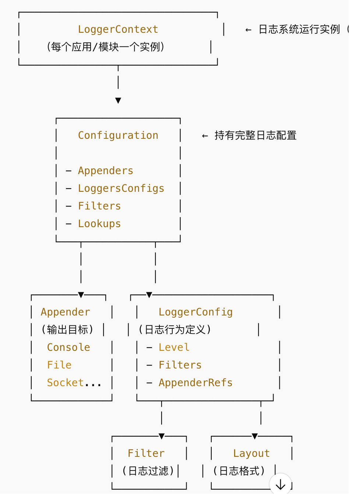

[toc]

# 日志门面

## SLF4j 

事实标准：SLF4j 

## Log4j2 API

Log4j API 比 SLF4J 有几个优势：

1. Log4j API 支持记录[消息](https://logging.apache.org/log4j/2.12.x/manual/messages.html)而不仅仅是字符串。
2. Log4j API 支持 lambda 表达式。
3. Log4j API 提供比 SLF4J 多得多的日志记录方法。
4.  除了 SLF4J 支持的“参数化日志记录”格式之外，Log4j API 还支持使用 java.text.MessageFormat 语法的事件以及 printf 样式的消息。
5. Log4j API 提供了 LogManager.shutdown() 方法。底层日志记录实现必须实现 Terminable 接口才能使该方法生效。
6. 完全支持其他构造，如标记、日志级别和 ThreadContext（又名 MDC）。

# 日志框架

## Log4j2 【高并发，大规模企业级别应用】

借鉴Logback

文档地址：https://logging.apache.org/log4j/2.12.x/

### 概念

Logger ：日志器实例访问入口，门面。

LogEvent ：每一条输出的日志语句都会生成一个LogEvent。

Filter : 日志是否进入Logger , 日志是否进入Appender, 全局FIlter 

Appender: 日志写在哪

LayOut : 日志输出的格式

Configuration : 描述 Logger,Filter,Appender 的关系

##  Logback [SLF4J 的 官方实现，SpringBoot默认集成]

手册地址 ：https://logback.qos.ch/manual/index.html

