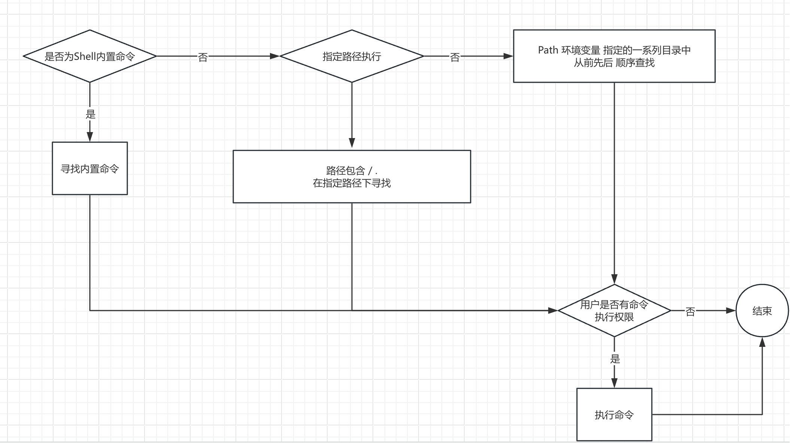

[toc]

# Linux 命令寻找，执行

# Java 启动参数

java 命令详细 ：https://docs.oracle.com/javase/8/docs/technotes/tools/windows/java.html

Java 命令用于启动一个Java程序。

Java命令通过启动JRE，加载指定的类，然后执行该类的main方法来启动Java程序。

JRE 在三组位置中搜索启动类（以及应用程序使用的其他类）：引导类路径、已安装的扩展和用户的类路径

引导类路径（JAVA_HOME/jre/lib）【启动类加载器】

扩展类路径（JAVA_HOME/jre/lib/ext）【扩展类加载器】

用户类路径CLASSPATH（默认值：如果未设置，以当前工作目录为用户的类路径,允许加载同目录或者子目录下的类）【系统类加载器】

默认情况下，第一个非 `java` 命令选项的参数是要调用的类的完全限定名。如果指定了 `-jar` 选项，则其参数是包含应用程序类和资源文件的 JAR 文件的名称。启动类必须由 `Main-Class` 指定 其源代码中的清单标头。

类文件名或 JAR 文件名后的参数被传递给 main 方法。

# 虚拟机类加载机制

生命周期：加载，验证，准备，解析，初始化，使用，卸载七个阶段。其中验证-准备-解析三个阶段，称为连接。

加载 - 验证 - 初始化 - 使用 -卸载 顺序是确定的。

##  类初始化的时机

1. 遇到 new , getstatic , putstatic ,invokestatic 指令，类型没有初始化的时候
2. 使用 reflect 反射包进行反射，类型还没有调用的时候
3. 初始化类的时候，发现父类还没有进行初始化，则先初始化父类
4. 当虚拟机启动时指定的需要执行的主类（包含main方法），先初始化这个主类
5. 当使用Java7新加入的动态语言支持时，如果MethodHandle实例最后解析的结果为REF_getStatic ,REF_putStatic, REF_invokeStatic,REF_newInvokeSpecial 四种类型的句柄时，并且这个句柄对应的类酶进行过初始化。
6. 当一个接口定义了JDK8新加入的default方法，如果接口的实现类发生了 初始化，那么该接口就要被初始化。

## 加载类的过程

1. 通过类的全限定名获取类的二进制字节流
2. 将这个字节流代表的静态存储结构转变为方法区的运行时数据结构
3. 在内存中生存一个代表这个类的Class对象，并作为方法区这个类的各种数据的访问入口。

# Java 程序

1. JDK安装后，追加  $JAVA_HOME/bin  到 PATH 环境变量中
2. 执行 java  命令
3. 执行类加载器的加载- 验证 - 初始化【完成类变量的零值和初始化】
4. 为新生对象分配内存，初始化为零值，设置对象头，然后执行类的构造方法。

