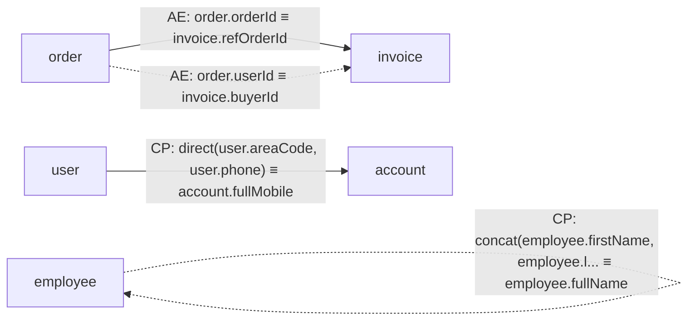

============================================================
  Mermaid Diagram
============================================================

============================================================
  Lineage Table
============================================================
+--------------------+---------------------------------------+-----------+-------+-------------------------------+
| 目标表字段         | 源表字段集合                          | 映射类型  | 模式  | 代码位置                      |
+--------------------+---------------------------------------+-----------+-------+-------------------------------+
| invoice.refOrderId | order.orderId                         | ATOMIC    | READ  | AtomicReadService.java:21     |
| invoice.buyerId    | order.userId                          | ATOMIC    | WRITE | AtomicWriteService.java:23    |
| employee.fullName  | employee.firstName, employee.lastName | COMPOSITE | WRITE | CompositeWriteService.java:23 |
| account.fullMobile | user.areaCode, user.phone             | COMPOSITE | READ  | CompositeReadService.java:21  |
+--------------------+---------------------------------------+-----------+-------+-------------------------------+