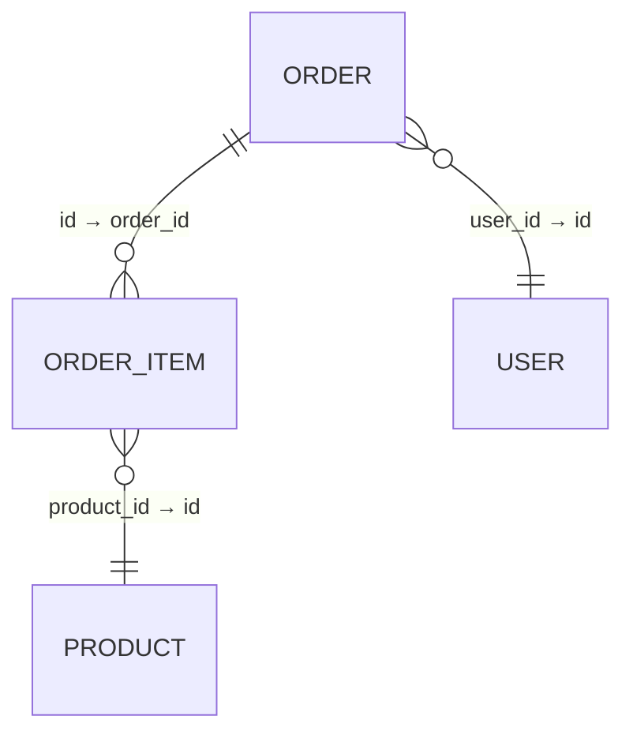
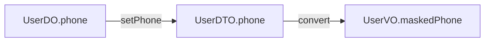

````markdown
# 🧩 Skill 设计方案 — Java Code Relation Analyzer

## 一、需求定义

### 目标
设计一个供 Claude Code 使用的 Skill，扫描 Java 业务代码库，自动分析并提取：
- **表模型关联关系**：实体间的外键、引用、JOIN 关系（ORM 注解解析）
- **字段血缘关系**：字段赋值链路追踪（Java 层 setter 调用链与直接赋值）

### 约束条件
| 参数 | 策略 |
|---|---|
| 技术栈 | 纯 Java，支持 JPA / Hibernate ORM 注解 |
| 输出形态 | Mermaid 图（ER 图 + 血缘流程图） |
| 表关系标注 | 标注具体字段关联关系 |
| 血缘深度 | 仅分析 Java 层赋值链路，不穿透 SQL 层 |

---

## 二、整体架构

```
业务代码目录
     ↓
┌─────────────────────────────────────┐
│           Skill Entry Point          │
│         analyze_code_relations       │
└──────────────┬──────────────────────┘
               ↓
┌──────────────────────────────────────────────────┐
│                  Scanner Layer                    │
│  ┌─────────────┐        ┌──────────────────────┐ │
│  │ EntityScanner│        │  FieldLineageScanner │ │
│  │ (ORM注解解析) │        │  (赋值链路追踪)       │ │
│  └─────────────┘        └──────────────────────┘ │
└──────────────┬───────────────────────────────────┘
               ↓
┌─────────────────────────────────────┐
│            Model Layer              │
│  TableModel / FieldRelation /       │
│  LineageChain                       │
└──────────────┬──────────────────────┘
               ↓
┌─────────────────────────────────────┐
│          Renderer Layer             │
│  MermaidERRenderer / MermaidFlow    │
│  Renderer                           │
└──────────────┬──────────────────────┘
               ↓
        Mermaid 输出报告
```

---

## 三、核心数据模型

```java
// 表模型
class TableModel {
    String tableName;          // 物理表名
    String entityClass;        // 对应 Java 类名
    List<FieldMeta> fields;    // 字段列表
}

// 字段元信息
class FieldMeta {
    String fieldName;          // Java 字段名
    String columnName;         // 数据库列名
    String javaType;           // Java 类型
    boolean isPrimaryKey;
    boolean isForeignKey;
}

// 表关联关系
class TableRelation {
    String sourceTable;
    String sourceField;        // 关联发起字段
    String targetTable;
    String targetField;        // 关联目标字段
    RelationType type;         // ONE_TO_ONE / ONE_TO_MANY / MANY_TO_MANY
}

// 字段血缘节点
class LineageNode {
    String className;
    String fieldName;
    NodeType type;             // SOURCE / TRANSFORM / SINK
}

// 血缘链路
class LineageChain {
    List<LineageNode> chain;   // 有序节点链
    String assignmentExpr;     // 原始赋值表达式快照
}
```

---

## 四、核心接口签名

```java
// 扫描入口
interface CodeAnalyzer {
    AnalysisResult analyze(Path sourceRoot);
}

// 实体关系扫描
interface EntityScanner {
    List<TableModel>    scanEntities(Path sourceRoot);
    List<TableRelation> scanRelations(List<TableModel> models);
}

// 字段血缘扫描
interface FieldLineageScanner {
    List<LineageChain> scanLineage(Path sourceRoot, String targetField);
}

// Mermaid 渲染
interface MermaidRenderer {
    String renderER(List<TableModel> models, List<TableRelation> relations);
    String renderLineage(List<LineageChain> chains);
}
```

---

## 五、Skill 指令设计

```
命令                                说明
──────────────────────────────────────────────────────
analyze:er      <path>              扫描全部实体，输出 ER 关系图
analyze:lineage <path> <field>      追踪指定字段的赋值血缘链路
analyze:all     <path>              同时输出 ER 图 + 全量血缘
```

---

## 六、预期输出样例

### ER 关系图（表关联）


### 血缘链路图（字段赋值）


---

## 七、技术选型

| 模块 | 方案 | 说明 |
|---|---|---|
| Java 源码解析 | JavaParser | AST 级别解析，精准提取注解与赋值表达式 |
| ORM 注解识别 | 反射 + AST | 支持 `@Table` `@Column` `@OneToMany` 等 JPA 注解 |
| 赋值链路追踪 | AST 遍历 | 追踪 setter 调用链与直接赋值语句 |
| 输出渲染 | 字符串模板 | 轻量，无需引入模板引擎 |

---

## 八、实现模块规划

```
Step 1 → Skill 入口与配置   (SKILL.md + analyzer.py)
Step 2 → EntityScanner      (ORM 注解解析)
Step 3 → FieldLineageScanner (赋值链路追踪)
Step 4 → MermaidRenderer    (输出渲染)
```
````

