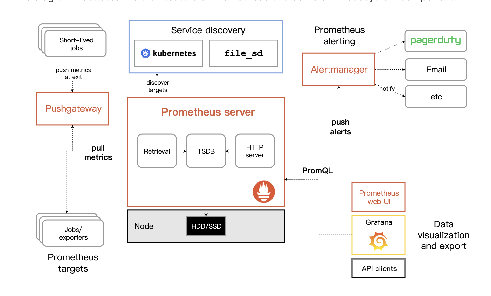
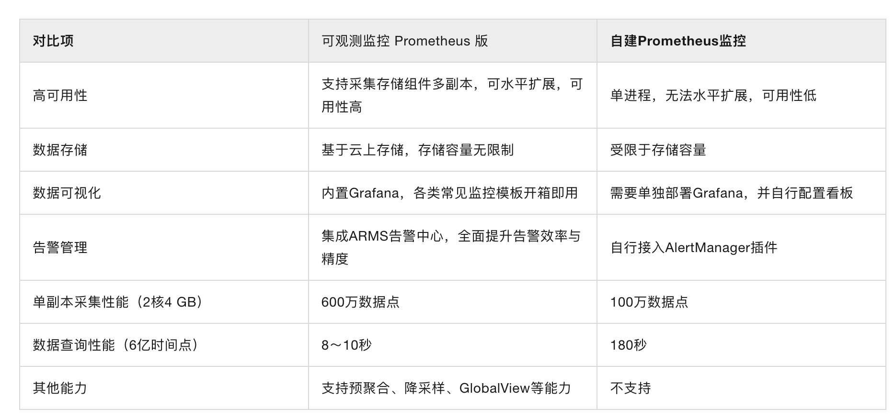

Prometheus基于Golang编写，编译后的软件包，不依赖于任何的第三方依赖。

因此为了能够监控到某些东西，如主机的CPU使用率，我们需要使用到Exporter。

Prometheus Server并不直接服务监控特定的目标，其主要任务负责数据的收集，存储并且对外提供数据查询支持。

Prometheus周期性的从Exporter暴露的HTTP服务地址（通常是/metrics）拉取监控样本数据。

用户还能直接使用`PromQL`实时查询监控数据。Grafana是一个开源的可视化平台，提供了对PromQL的完整支持

